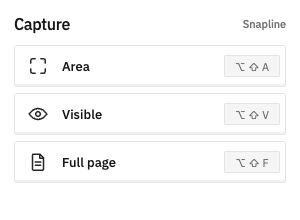
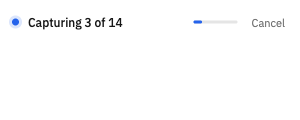

# Snapline

Snapline is a private, local-first Chrome extension for selected-area,
visible-viewport, and full-page screenshots. It produces PNG files entirely
inside the browser—without accounts, analytics, network requests, or remotely
hosted code.

<p align="center">
  
  
</p>

## Highlights

- Capture a selected area, the visible viewport, or a vertically stitched full
  page.
- Use keyboard shortcuts from anywhere in Chrome and single-key actions in the
  preview.
- Preserve HiDPI output and Display P3 when the browser exposes it, with an
  explicitly tagged sRGB fallback.
- Warm lazy content, settle nearby media, and restore scroll, animation, and
  video state after full-page capture or cancellation.
- Copy or download PNG output from a persistent preview.
- Follow the system light/dark appearance with locally bundled fonts and icons.

Snapline requests only `activeTab`, `scripting`, `offscreen`, and
`clipboardWrite`. Captures remain in browser-local storage only long enough to
support their preview tabs.

## Install locally

Requirements: Node.js 20.19 or newer and Chrome 111 or newer.

```sh
npm ci
npm run build
```

Then open `chrome://extensions`, enable **Developer mode**, choose **Load
unpacked**, and select the generated `dist` directory.

Default shortcuts:

- `Option+Shift+A` on macOS / `Alt+Shift+A` elsewhere — selected area
- `Option+Shift+V` on macOS / `Alt+Shift+V` elsewhere — visible viewport
- `Option+Shift+F` on macOS / `Alt+Shift+F` elsewhere — full page

Chrome shortcut assignments can be changed at
`chrome://extensions/shortcuts`.

## Development

```sh
npm ci
npm run check
```

`npm run check` runs the unit suite, strict TypeScript validation, and the
production build. The Chromium extension suite is available separately:

```sh
npx playwright install chromium
npm run test:e2e
```

The test suite covers geometry, full-page tiling, PNG encoding and color
metadata, filenames, durable IndexedDB writes, offscreen-document lifecycle,
page-state restoration, cancellation, browser UI, and capture flows.

## Architecture

- `src/background.ts` coordinates capture modes, tabs, shortcuts, progress,
  and previews.
- `src/content.ts` owns the selected-area overlay and full-page DOM
  preparation/restoration.
- `src/offscreen.ts` crops and stitches bitmap data outside the service worker.
- `src/png.ts` streams RGBA8 PNG output with matching color metadata.
- `src/popup.tsx` and `src/preview.tsx` provide the Preact interface.

The interface uses Preact, Tailwind CSS v4, and Vite. Capture orchestration,
content injection, offscreen processing, and PNG encoding remain
framework-free TypeScript.

## Limitations

- Chrome blocks script injection on protected pages such as `chrome://` URLs
  and the Chrome Web Store.
- Full-page capture uses the current viewport width and freezes the page height
  after a bounded warm-up; it does not chase infinite-scroll content.
- Continuously script-rendered Canvas or WebGL scenes have no generic settle
  signal, so Snapline captures the latest frame after a bounded wait.
- Very large pages can exceed browser memory or downstream image-viewer limits.

## License

Copyright © 2026 Enes Aykuter. All rights reserved. The source is available for
portfolio review only; see [`LICENSE`](LICENSE) for details.
